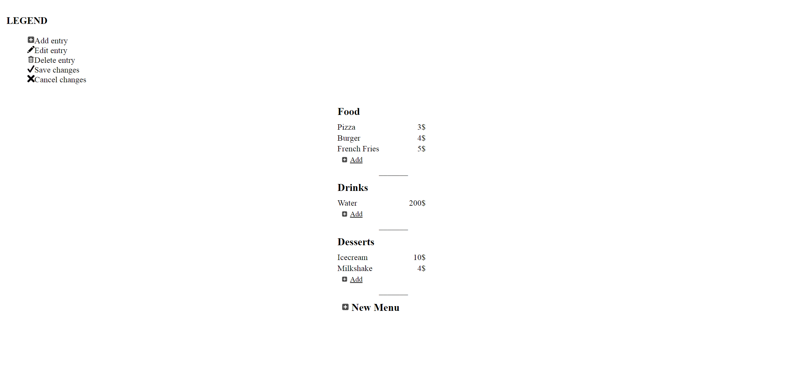

# A simple editable menu
by Hadrien Pouget

This is a sample app which is supposed to represent a basic restaurant menu. The menu can be completely edited - new sections can be added, and new items in each of the sections. Current items can also be updated.

Run with `npm start`

